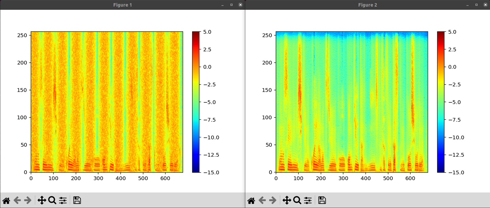

# ESPnet ASR Extrakit #
This repository provides simple examples and extra modules using [ESPnet](https://github.com/espnet/espnet) ASR for **academic research and education (training)**. 
Our voice activity detection (VAD) interface [pyadintool](https://github.com/ouktlab/pyadintool) and [examples of pretrained models](https://github.com/ouktlab/espnet_asr_models) will help you to run examples and to develop a spoken dialogue system robust against reverberations and noises. 
Note that coding standards, error handling, comments and so on in this toolkit are not suitable for joint development.


## Requirements ##
ESPnet is required because our toolkit depends on the python environment and source codes of it. 

- OS: Ubuntu 22.04 (or maybe later) or Ubuntu 22.04 on Windows WSL
  - GPU environment is recommended if you want to run programs for training
  - Speech recognition (inference) will work even on CPU (multi-threading)
- espnet (source code + install): our patch files depend on a specific commit that may be a little old version.
- make (for compiling ESPnet tools)
- python3.10 (or maybe later)
- openfst / libfst-tools (for WFST LM)
- git lfs

Python3.10 is suitable for installation of ESPnet (as of 2024/8).


Optional: additional python libraries are required for simple grammar editor.
- tkinter
- eel
- google chrome/chromium


<a id="contents"></a>

## Contents ##
**Please read the script files and source codes to follow the details.** We need to run programs by calling "launcher" file to load python environment of ESPnet in advance.  

- [ASR training example](#asr_training_example)
- [LM training example](#lm_training_example)
- [Evaluation example](#evaluation_example)
- [Alignment example](#alignment_example)
- [Streaming ASR example](#streaming_example)
- [Character-level probability](#char-level_prob)
- [WFST LM](#wfst_lm)
- [MD-ASR](#md_asr)

Never use the audio data of this repository for other purposes. 

## Installation and Preparation ##
### step 1: install ESPnet and create launcher ###
Install ESPnet according to the instruction of ESPnet. Although the following command is described in the "setup.sh" file (and will be skipped in default), it is better to run them by your own hands. 
```
$ git clone https://github.com/espnet/espnet.git
$ cd espnet
$ cd tools
$ ./setup_venv.sh $(command -v python3)
$ make
$ cd ../../
```


Then, copy and edit the "launcher" file.
```
$ cp script/launcher.tmpl script/launcher
$ emacs -nw script/launcher  
```
Set your ESPnet directory to the "__ESPNET_ROOT" variable. If the directory of this repository is "~/git/espnet_asr_extrakit/", please set the path as follows:
```
__ESPNET_ROOT=~/git/espnet_asr_extrakit/espnet/
```

### step 2: set up experimental environments and others ###
Please use the shell script to setup experimental environments and to download pretrained models automatically. It sometimes asks you to type your password for installations using "sudo apt".
```
$ sh setup.sh
```
Run each command step-by-step by editing the "\$stage" variable in the shell script and adding the "exit" command to the end of each section when you want to understand what happens or you are in trouble. 

If you want to try WFST LM, please edit the "setup.sh" as
```
enable_wfst=true
```

### step 3: apply patch files for extension ###
If you want to use extended functions, please apply the patch files to the ESPnet source codes. 
```
$ cd extend
$ sh setup.sh
```

Note that **our patch files depend on the version of source codes**.  
Therefore, the shell script above executes "git checkout" command at first to adjust the version of source codes to that of patch files. 
```
version=ver2502
checkoutv=b57dd0418ab2f7a03a21239f70decb9837cb2b0f # for ver2502

#####################
if [ -n "${checkoutv}" ] && [ $stage -le 0 ]; then
  cd ../espnet/
  echo "git checkout ${checkoutv}"
  git checkout ${checkoutv}
  cd ../extend/
fi
```
**Be careful not to affect the original source codes of ESPnet at remote by applying other command of git to this cloned repository.**


Set the options such as "uninstall_*" to "true" in the "setup.sh" to uninstall (to recover), and run it.
```
$ emacs -nw setup.sh
install_wfst=
uninstall_wfst=true
install_md=
uninstall_md=true
install_cprob=
uninstall_cprob=true
$ sh setup.sh
```


<a id="asr_training_example"></a>
## ASR training example ###
### Preparation
Move to the working directory.
```
$ cd train_asr
```

All you need is to prepare 
 - audio files
 - their transcriptions, and
 - two list files (key-path, key-text)

for training ASR model. Here, we use the already prepared data for this section.  

A small amount of data is stored in the "data/" directory. 
```
$ ls data/audio/
ambig01.flac  data022.flac  data024.flac  data026.flac  data028.flac  name01.flac      railroad02.flac
data021.flac  data023.flac  data025.flac  data027.flac  data040.flac  railroad01.flac  railroad03.flac
```
Note that **more and more data** or **freezing some parameters** will be required for actual training or fine tuning.

The audio files are listed as the pairs of key and its audio file path in the "data/list/egs_train_key-path.txt" file.
```
$ cat data/list/egs_train_key-path.txt
spkr01-key_data021 data/audio/data021.flac
spkr01-key_data022 data/audio/data022.flac
spkr01-key_data023 data/audio/data023.flac
spkr01-key_data024 data/audio/data024.flac
spkr01-key_data025 data/audio/data025.flac
spkr01-key_data026 data/audio/data026.flac
spkr01-key_data027 data/audio/data027.flac
spkr01-key_data028 data/audio/data028.flac
```

Corresponding transcriptions are also listed in the "data/list/egs_train_key-text.txt". We used the text data from Wikipedia for this example. 
```
$ cat data/list/egs_train_key-text.txt
spkr01-key_data021 音声認識は声がもつ情報をコンピュータに認識させるタスクの総称である
spkr01-key_data022 ヒトの音声認識と対比して自動音声認識とも呼ばれる
spkr01-key_data023 例として文字起こしや話者認識が挙げられる
spkr01-key_data024 音声認識は音声に含まれる情報を認識するタスクの総称であり具体的に解かれる問題の例として以下が挙げられる
spkr01-key_data025 音声認識をサブタスクとして含むタスクには以下が挙げられる
spkr01-key_data026 音声認識では統計的手法が良く用いられている
spkr01-key_data027 これは大量の発話を記録した学習用データから音声の特徴を蓄積し
spkr01-key_data028 認識対象となる入力音声から抽出した特徴と蓄積された特徴とを比較しながら
```

The list files for validation set are also prepared. 
```
$ ls data/list/egs_valid_key-*
data/list/egs_valid_key-path.txt  data/list/egs_valid_key-text.txt
```

Replace these files into your own files, and you can train your own model by using your own training data .

### Training from scratch ####
Just run the shell script.
```
$ sh run.egs.scratch.sh
```
The training can be achieved by calling the "espnet2.bin.asr_train" script of ESPnet. 
The script generates "token list" and statistics files of data sets including parameter file for *mvn* (mean variance normalization) of speech feature. 


Note that you need to change the parameter "batch_bins" according to the amount of your data and your GPU memory. 


### Fine tuning ####
Just run the shell script.
```
$ sh run.egs.finetune.sh
```

The pretrained model is specified by the option "--init_param". **The "token list" of the pretrained model must be specified by the option "--token_list" for this fune tuning.** In our example, this token list is automatically extracted from the configuration file of pretrained ASR model by the "setup.sh" in the preparation section. 
```
$ head train_asr/exp/egs_pretrained/tokens.txt 
<blank>
<unk>
の
い
で
と
ー
て
う
ま
```

Whether the *mvn* parameter file is updated or not may depend on your data set and its amount.

Note that you need to change the parameter "batch_bins" according to the amount of your data and your GPU memory. 


[Back to contents](#contents)

<a id="lm_training_example"></a>

## LM training example ###
### Preparation ###
Move to the working directory.
```
$ cd train_lm
```

All you need is to prepare only
 - text file

for training LM.

The text file is the same format as the transcription file used in the ASR model training. In this example, the same key-text file is used. 
```
$ cat data/list/egs_train_key-text.txt
spkr01-key_data021 音声認識は声がもつ情報をコンピュータに認識させるタスクの総称である
spkr01-key_data022 ヒトの音声認識と対比して自動音声認識とも呼ばれる
spkr01-key_data023 例として文字起こしや話者認識が挙げられる
spkr01-key_data024 音声認識は音声に含まれる情報を認識するタスクの総称であり具体的に解かれる問題の例として以下が挙げられる
spkr01-key_data025 音声認識をサブタスクとして含むタスクには以下が挙げられる
spkr01-key_data026 音声認識では統計的手法が良く用いられている
spkr01-key_data027 これは大量の発話を記録した学習用データから音声の特徴を蓄積し
spkr01-key_data028 認識対象となる入力音声から抽出した特徴と蓄積された特徴とを比較しながら
```


Note that the **"token list" must be shared between ASR and LM models**. The token list file will be automatically generated by the shell scripts in the next section.  
```
$ head exp/egs_scratch/tokens.txt 
<blank>
<unk>
あ
い
か
が
く
げ
こ
さ
```
**Be careful when you use text data different from the transcription used in the ASR model training or fine tuning**. 

### Training from scratch ####
Just run the shell script.
```
$ sh run.egs.scratch.sh
```

The training can be achieved by calling the "espnet2.bin.lm_train" script of ESPnet.  
### Fine tuning ####
Just run the shell script.
```
$ sh run.egs.finetune.sh
```

The pretrained model is specified by the option "--init_param". **The "token list" of the pretrained model must be specified by the option "--token_list" for this fine tuning.**  


[Back to contents](#contents)


<a id="evaluation_example"></a>

## Evaluation example ##
### Preparation ###
Move to the working directory.
```
cd eval
```

### Procedure in the script ###
The example shell script executes the following four steps. 
1. recognize audio files: data/audio/data???.flac
1. convert the recognized text into token-wise format: hyp file
1. convert the reference text (correct transcription) into token-wise format: ref file
1. calculate scores using the "sclite" command in ESPnet


Just run the shell script.
```
$ sh run.local.sh
```
If you want to run in "cpu" mode, please modify the "device" variable in the shell script.
```
stage=0
device=cpu
```


The recognized text file is saved in "exp/asr_recog".
```
eval$ cat exp/asr_recog/list_asr_result.txt 
spkr01-key_data021      …音声認識は声が持つ情報をコンピューターに認識させるタスクの総称である…
spkr01-key_data022      …人の音声認識と対比して自動音声認識とも呼ばれる…
```

We can see the recognition performance (CER) by opening the "exp/asr_recog/score.txt" file. 
Correctness, substitution, deletion, insertion, and error rates (corresponds to CER) are shown in this table. 
```
eval$ grep -B 4 Sum/ exp/asr_recog/score.txt 
       | SPKR   | # Snt # Wrd | Corr    Sub    Del    Ins    Err  S.Err |
       |--------+-------------+-----------------------------------------|
       | spkr01 |    8    242 | 97.1    2.1    0.8    0.4    3.3   50.0 |
       |================================================================|
       | Sum/Avg|    8    242 | 97.1    2.1    0.8    0.4    3.3   50.0 |
```


[Back to contents](#contents)


<a id="alignment_example"></a>

## Alignment example ###

### Functions and Applications
The accuracy of alignment my not be enough for practical use. Because there may be some inappropriate procedures, this example is just for demonstration. 

- Audio-character alignment using transcription of audio file and output from CTC or Attention networks
  - CTC: CTC segmentation class in ESPnet is used.
  - Attention: our tentative and ad-hoc implementation is used. 

Note that the performance depends on ASR models, token set and token unit. 

### Preparation
Move to the working directory.

```
$ cd align
```

### Procedure in the script ###
Just run the shell script to see examples. 
```
sh run.egs.align.sh
```

The alignments of the following setting will be shown. Please see the script for details. 
1. CTC-based alignment using Katakana model (for a file)
1. CTC-based alignment using KanaKanji model (for a file)
1. Attention-based alignment using Katakana model (for a file)
1. Attention-based alignment using KanaKanji model (for a file)
1. Attention-based alignment using Katakana model (for a file list)
1. Attention-based alignment using KanaKanji model (for a file list)


```
---- stage 1 ----
file: data/audio/ambig01.flac
0.17 0.41 …
0.41 0.61 オ
0.61 0.75 ン
0.75 0.94 セ
0.94 1.14 ー
1.14 1.33 …
1.53 2.06 ニ
2.06 2.20 ン
2.20 2.35 シ
2.35 2.49 キ
2.49 2.74 …
2.94 3.46 モ
3.46 3.61 デ
3.61 3.80 ル
3.80 4.00 …
---- stage 2 ----
file: data/audio/ambig01.flac
0.17 0.41 …
0.41 0.61 音
0.61 0.99 声
0.99 1.33 …
1.53 2.06 認
2.06 2.35 識
2.35 2.74 …
2.94 3.46 モ
3.46 3.61 デ
3.61 3.80 ル
3.80 4.00 …
---- stage 3 ----
file: data/audio/ambig01.flac
0.00 0.48 …
0.48 0.68 オ
0.68 0.82 ン
0.82 1.07 セ
1.07 1.21 ー
1.21 1.89 …
1.89 2.08 ニ
2.08 2.23 ン
2.23 2.37 シ
2.37 2.62 キ
2.62 3.34 …
3.34 3.54 モ
3.54 3.73 デ
3.73 3.87 ル
3.87 4.02 …
4.02 4.79 <sos/eos>

...
```


The following figure shows alignment results of CTC- and attention-based segmentation: the top text is given by CTC, and the bottom text is given by attention.
The attention-based segmentation seems good. 


[Back to contents](#contents)


<a id="streaming_example"></a>

## Streaming ASR example
### Functions and Applications
- Streaming ASR example using contextual-block-transformer to obtain real-time recognition results
- Patch files to improve flexibility
  - Enable options: block size, hop size, look ahead
  - Implementation of "from_pretrained" method
  - Removal of duplicated N-best results

Note that this function requires to apply patch files to the ESPnet's source codes. 

### Preparation
Some patch files need to be applied to the ESPnet source codes. If you have not run the setup script yet, move to "extend/" directory and run it.
```
$ cd extend
$ sh setup.sh
$ cd ../
```

Move to the working directory.

```
$ cd streaming_asr
```

### Procedure in the script
Just run the shell script. 
```
$ sh run.streaming.sh
```
If you want to run ASR in "cpu" mode, change the \${device} variable in the script.


In this example, a current hypothesis will be displayed in real-time. At first, the recognition results using KanaKanji model are shown.
```
[LOG]: data/audio/data021.flac
[LOG]: real-time result -- 音声認識は声が持つ情報をコンピューターに
[LOG]: N-best results
[LOG]:   音声認識は声が持つ情報をコンピューターに認識させるタスクの総称である
[LOG]:   ん音声認識は声が持つ情報をコンピューターに認識させるタスクの総称である
[LOG]:   音声認識が声が持つ情報をコンピューターに認識させるタスクの総称である
[LOG]:   え音声認識は声が持つ情報をコンピューターに認識させるタスクの総称である
[LOG]:   音声認識や声が持つ情報をコンピューターに認識させるタスクの総称である
[LOG]: data/audio/data022.flac
[LOG]: real-time result -- 人の音声認識と対比して自動
[LOG]: N-best results
[LOG]:   人の音声認識と対比して自動音声認識とも呼ばれる
[LOG]:   人の音声認識と対比して自動音声認識とも呼ばれるって
[LOG]:   人の音声認識と対比して自動音声認識とも呼ばれると
[LOG]:   人の音声認識と対比して自動音声認識とも呼ばれるて
[LOG]:   人の音声認識と対比して自動音声認識とも呼ばれるう
[LOG]: data/audio/data023.flac
[LOG]: real-time result -- 例として文
[LOG]: N-best results
[LOG]:   例として文字起こしや話者認識が挙げられる
[LOG]:   例として文字起こしや話者認識が挙げられるえ
[LOG]:   例として文字起こしや話者認識が挙げられるう
[LOG]:   例として文字起こしや話者認識が上げられる
[LOG]:   例として文字起こしや話者認識が挙げられると
```

Then, the recognition results using Katakana model are shown.
```
[LOG]: data/audio/data021.flac
[LOG]: real-time result -- …オンセーニンシキワコエガモツジョーホーオコンピューターニニンシキサセルタ
[LOG]: N-best results
[LOG]:   …オンセーニンシキワコエガモツジョーホーオコンピューターニニンシキサセルタスクノソーショーデアル…
[LOG]:   …オンセーニンシキワコエガモツリョーホーオコンピューターニニンシキサセルタスクノソーショーデアル…
[LOG]:   …オンセーニンシキワコエオモツジョーホーオコンピューターニニンシキサセルタスクノソーショーデアル…
[LOG]:   …オンセーニンシキワコエガモツジョーホーコンピューターニニンシキサセルタスクノソーショーデアル…
[LOG]:   ンオンセーニンシキワコエガモツジョーホーオコンピューターニニンシキサセルタスクノソーショーデアル…
[LOG]: data/audio/data022.flac
[LOG]: real-time result -- …ヒトノオンセーニンシキトタイヒシテジドーオンセーニンシキ
[LOG]: N-best results
[LOG]:   …ヒトノオンセーニンシキトタイヒシテジドーオンセーニンシキトモヨバレル…
[LOG]:   …ヒトノオンセーニンシキオタイヒシテジドーオンセーニンシキトモヨバレル…
[LOG]:   …ヒトノオンセーニンシキノタイヒシテジドーオンセーニンシキトモヨバレル…
[LOG]:   …ヒトノオンセーニンシキデタイヒシテジドーオンセーニンシキトモヨバレル…
[LOG]:   …ヒトノオンセーニンシキデオタイヒシテジドーオンセーニンシキトモヨバレル…
[LOG]: data/audio/data023.flac
[LOG]: real-time result -- …レートシテモジオコシヤワシャニ
[LOG]: N-best results
[LOG]:   …レートシテモジオコシヤワシャニンシキガアゲラレル…
[LOG]:   レートシテモジオコシヤワシャニンシキガアゲラレル…
[LOG]:   …レートシテモジオコシワワシャニンシキガアゲラレル…
[LOG]:   …レートシテモジオコシオワシャニンシキガアゲラレル…
[LOG]:   …レートシテモジオコシアワシャニンシキガアゲラレル…
```


If you want to try other streaming Japanese models, 
please visit our site, [espnet_asr_models](https://github.com/ouktlab/espnet_asr_models).


### Tunable parameters
If you want to reduce the latency time, the "beam_size" parameter should be changed. While the "beam_size" is set to 40 in other ASR examples, 10 is used in this example. Note that there is a trade-off between the latency time and the search accuracy during decoding. 

- beam_size
- nbest


### Streaming ASR server based on adinnet
This example shows the streaming ASR through network. We can see real-time recognition result (every certain blocks/secs.).
The I/O interface follows the *adinnet* specification used in [Julius](https://github.com/julius-speech/julius) and [pyadintool](https://github.com/ouktlab/pyadintool). 

Just run the shell script for the streaming ASR server. The service will start with the "localhost:5530" setting (IP and port) and the default huggingface model repository.
```
$ sh run.asrserver.sh
```
If you want to run ASR in heavy "cpu" mode, change the \${device} variable in the script.


In the same PC, run the pyadintool (client) just as 
```
(main) $ python3 pyadintool.py conf/default4asr.yaml --in mic --out adinnet --server localhost --port 5530
```
Instead of pyadintool, original *adintool* will be available for the client. 


[Back to contents](#contents)


<a id="char-level_prob"></a>

## Character-level probability

### Functions and Applications
- Utilization of the probability of each recognized character 
- Verification using the probability information
  - Selection of audio data for annotation (transcription)
  - Modification or standardization of suspicious transcription in the training data (by combining WFST LM)

Note that this function requires to apply patch files to the ESPnet's source codes. 


### Preparation
Some patch files need to be applied to the ESPnet source codes. If you have not run the setup script yet, move to "extend/" directory and run it.
```
$ cd extend
$ sh setup.sh
$ cd ../
```

Move to the working directory.

```
$ cd cprob_asr
```

### Procedure in the script ###
Just run the shell script. 
```
$ sh run.egs.cprobasr.sh 2> /dev/null
```
If you want to run ASR in "cpu" mode, change the \${device} variable in the script.


Recognition results will be displayed after several seconds. 
```
[LOG]: data/audio/railroad01.flac
[LOG]: RTF=0.62, Score=-4.427, text=…京都駅から品川まで…, decoder=-1.430, ctc=-0.145, lm=-31.260,
chars  : …      京     都     駅     か     ら     品     川     ま     で     …      <sos/eos>   SUM
decoder: -0.081 -0.044 -0.086 -0.077 -0.070 -0.066 -0.583 -0.133 -0.070 -0.070 -0.080 -0.071  -- -1.430
ctc    : -0.000 -0.000 -0.000 -0.000 -0.000 -0.000 -0.143 -0.000 -0.000 -0.000 -0.000 -0.000  -- -0.145
lm     : -1.428 -7.576 -0.440 -4.413 -1.618 -0.018 -8.685 -0.011 -2.308 -0.002 -4.252 -0.509  -- -31.260
[LOG]: data/audio/railroad02.flac
[LOG]: RTF=0.30, Score=-3.995, text=…東京駅から新横浜まで…, decoder=-0.996, ctc=-0.004, lm=-30.987,
chars  : …      東     京     駅     か     ら     新     横     浜     ま     で     …      <sos/eos>   SUM
decoder: -0.081 -0.108 -0.062 -0.087 -0.067 -0.070 -0.048 -0.103 -0.079 -0.071 -0.069 -0.079 -0.072  -- -0.996
ctc    : -0.002 -0.000 -0.000 -0.000 -0.000 -0.000 -0.000 -0.000 -0.000 -0.000 -0.000 -0.000 -0.000  -- -0.004
lm     : -1.428 -6.173 -0.650 -4.127 -1.704 -0.008 -3.891 -4.477 -0.004 -3.914 -0.002 -4.079 -0.530  -- -30.987
[LOG]: data/audio/railroad03.flac
[LOG]: RTF=0.35, Score=-6.042, text=…小倉から福山まで…, decoder=-2.766, ctc=-5.099, lm=-30.425,
chars  : …      小     倉     か     ら     福     山     ま     で     …      <sos/eos>   SUM
decoder: -0.083 -1.972 -0.040 -0.084 -0.071 -0.142 -0.075 -0.078 -0.074 -0.079 -0.070  -- -2.766
ctc    : -0.000 -0.943 -3.538 -0.003 -0.001 -0.608 -0.005 -0.001 -0.000 -0.000 -0.000  -- -5.099
lm     : -1.428 -5.845 -4.785 -4.554 -0.093 -5.984 -2.743 -0.944 -0.001 -3.654 -0.393  -- -30.425
```


[Back to contents](#contents)


<a id="wfst_lm"></a>
## WFST LM ###
### Functions and Applications ###
- Speech recognition using WFST LM (weight finite state transducer, language model) as a character-level **decoding** constraint
  - This LM is used during decoding. Not for rescoring.
- Utilization of the traditional explicit grammar-based LM and N-gram LM constructed by using openfst tools
  - the behavior of ASR in our examples looks like the traditional ASR style using acoustic model (Katakana recognition) and language model (Katakana to KanaKanji conversion)
  - but ASR models for this WFST LM are not limited to the Katakana model
- Any pronunciation spotting: speech recognition by allowing a partial arbitrary character sequence in a grammar network by using *any matching tag*

Note that this function requires to apply patch files to source codes. 


### Preparation ###
Change the "enable_wfst" and "stage" variables in the "setup.sh" and run the script in the root directory of this toolkit if you have not done yet. 
```
$ emacs -nw setup.sh # edit option
enable_wfst=true
$ sh setup.sh
```
Note that the script file tries to install the following software and libraries by "sudo apt". Please type sudo password if you do not mind. 
```
sudo apt-get install python3.10-tk libfst-tools chromium-browser
```


Some patch files also need to be applied to the ESPnet source codes. If you have not run the setup script yet, move to "extend/" directory and run it.
```
$ cd extend
$ sh setup.sh
$ cd ../
```

The virtual environment for this example needs to be activated.
```
$ . venv/bin/activate
```

Move to the working directory.
```
cd wfst_asr
```

### Procedure in the script
Just run the shell script.
```
sh run.egs.asr.sh 2> /dev/null
```

If you want to run in "cpu" mode, please modify the "device" variable in the shell script.
```
stage=0
device=cpu
```

The process of this script file consists of four parts:
1. file format conversion: vis network format (our own format) into the text FST format (run.vis2fst.sh)
1. composition of FST files (run.vis2fst.sh)
1. FST format conversion: text fst format into the binary file of WFST LM class (mkwfst.py)
1. recognition using generated WFST LM (wfstasr.py)
   - example of Katakana ASR model and WFST LM (Katakana to KanaKanji)
   - example of Katakana ASR model and WFST LM (Katakana to KanaKanji) using "any matching tag"
1. recognition using prepared WFST LM (wfstasr.py) for ambiguity resolution of transcription
   - example of short pause estimation using WFST LM (Katakana, KanaKanji)


The vis files locate in the "tmpl_vis" directory. We can see the grammar structure of these files by using "auxtool/editor.py". 

If you are good at using openfst tools, you can directly generate your own WFST. Please be careful of the following: 
- the set of input symbols must be a subset of the **token set** used in the ASR model
- the weight usually corresponds to the **log** score
- binarization using "mkwfst.py" in advance is recommended due to the heavy loading time of model

### Vis file and its editor for grammar-based LM
We can see the example grammar files via our editor.   
The browser-based editor will open by the following command.
```
(venv) $ python3 auxtool/editor.py
```
Click "load" button and select the "net_station.vis" file in the "tmpl_vis" directory.


The figure above shows the structure of this vis network file. Each node denotes a word, and each edge denotes a link between words. 
The following are explanations of some symbols.
- \<s>: start of sentence 
- \</s>: end of sentence
- 駅+エキ: word and its pronunciation in Katakana
- @station: tag for network replacement (using fstreplace)


This network defines an acceptable sentence (utterance) set. For example, the following utterances will be recognized well. 
```
@station から @station まで
@station から @station まで の 経路 を 教えて
@station 駅 から @station まで の チケット
@station 駅 から @station まで の チケット ください
...
```

The @station symbol is replaced by other networks such as "net_station.vis" and "any word fst" in the shell script. The "net_station.vis" includes the following words. 
```
東京+トーキョー
品川+シナガワ
新横浜+シンヨコハマ
名古屋+ナゴヤ
新大阪+シンオーサカ
```
Therefore, the whole network can accept utterances such as "東京 から 品川 まで" and "名古屋 から 新大阪 まで". 

### Composition of FST files ###
This step uses standard openfst tools, such as, determinize, minimize, replace, and so on.
It is better to see the [openfst site](https://www.openfst.org/twiki/bin/view/FST/WebHome) to understand this tools. 

The generated FST files are saved in "fst_model" directory. 
```
wfst_asr$ ls fst_model
railroad_any_final.fst railroad_any_final.fst
```

### Generation of binary WFST file ###
The text FST files can be converted into binary files of WFST LM to reduce the model loading time in ASR. 
The "mkwfst.py" program requires the configuration file of ASR model and text FST file, 
and it outputs a wfst configuration file and a binary WFST file. WFST ASR uses these two files in recognition.

The actual model path "\${kat_modeldir}" and FST filename "\${x}" are defined in the shell script.
```
$ ../script/launcher python3 mkwfst.py \
    ${kat_modeldir}/exp/asr_train_asr_transformer_ja_raw_jp_char_sp/config.yaml.update \
    fst_model/${x}_final.config \
    --textfile fst_model/${x}_final.fst \
    --pklfile fst_model/${x}_final.bin
```

### Recognition of audio data ###
The recognition using WFST LM is done by the "wfstasr.py" script. 
Audio files for recognition can be specified by the "--wavfiles" option. The actual model path "\${kat_modeldir}" is defined in the shell script.

```
$ ../script/launcher python3 wfstasr.py \
    conf/decode.wfst.yaml \
    --wavfiles data/audio/railroad01.flac \
    --asr_train_config ${kat_modeldir}/exp/asr_train_asr_transformer_ja_raw_jp_char_sp/config.yaml.update \
    --asr_model_file ${kat_modeldir}/exp/asr_train_asr_transformer_ja_raw_jp_char_sp/valid.cer.ave_10best.pth \
    --lm_train_config fst_model/railroad_any_final.config \
    --device ${device} \
```

#### Example 1: railroad network ####
Actual utterances in the "railroad01.flac", "railroad02.flac", and "railroad03.flac" files: 
```
京都駅から品川まで
東京駅から新横浜まで
小倉から福山まで
```

Recognition results using the "railroad_station" fst: Becuase the words "小倉" and "福山" are not defined in the network (out-of-vocabulary),
the word "名古屋" was forced to match the audio speech. We can see that its score is abviously lower than those of others.
The RTF of the first audio file is relatively high due to the memory allocations or cache preparations. 
```
[LOG]: data/audio/railroad01.flac
[LOG]: RTF=0.59, Score=-17.037, text=キョートエキカラシナガワマデ
[LOG]: [station],京都,[/station],駅,から,[station],品川,[/station],まで
[LOG]: data/audio/railroad02.flac
[LOG]: RTF=0.26, Score=-17.630, text=トーキョーエキカラシンヨコハママデ
[LOG]: [station],東京,[/station],駅,から,[station],新横浜,[/station],まで
[LOG]: data/audio/railroad03.flac
[LOG]: RTF=0.37, Score=-66.909, text=ナゴヤカラナゴヤマデ
[LOG]: [station],名古屋,[/station],から,[station],名古屋,[/station],まで
```
Recognition results using the "railroad_any" fst. Any pronuciations (characters) can be recognized in the *any tag* sections. Several parsing possibilities are also shown. 
```
[LOG]: data/audio/railroad01.flac
[LOG]: RTF=0.76, Score=-17.037, text=キョートエキカラシナガワマデ
[LOG]: [any],キ,ョ,ー,ト,[/any],駅,から,[any],シ,ナ,ガ,ワ,[/any],まで
[LOG]: [any],キ,ョ,ー,ト,エ,キ,[/any],から,[any],シ,ナ,ガ,ワ,[/any],まで
[LOG]: data/audio/railroad02.flac
[LOG]: RTF=0.40, Score=-17.630, text=トーキョーエキカラシンヨコハママデ
[LOG]: [any],ト,ー,キ,ョ,ー,[/any],駅,から,[any],シ,ン,ヨ,コ,ハ,マ,[/any],まで
[LOG]: [any],ト,ー,キ,ョ,ー,エ,キ,[/any],から,[any],シ,ン,ヨ,コ,ハ,マ,[/any],まで
[LOG]: data/audio/railroad03.flac
[LOG]: RTF=0.39, Score=-16.518, text=コクラカラフクヤママデ
[LOG]: [any],コ,ク,ラ,[/any],から,[any],フ,ク,ヤ,マ,[/any],まで
```

#### Example 2: name network ####
Actual utterance in the "name01.flac" file.
```
名字は田中で名前はイーサンです
```

Recognition results using the "name_any" fst. Several parsing possibilities are also shown.  
```
[LOG]: data/audio/name01.flac
[LOG]: RTF=0.62, Score=-16.873, text=ミョージワタナカデナマエワイーサンデス
[LOG]: 名字,は,[any],タ,ナ,カ,デ,ナ,マ,エ,ワ,イ,ー,サ,ン,[/any],です
[LOG]: 名字,は,[any],タ,ナ,カ,[/any],で,名前,は,[any],イ,ー,サ,ン,[/any],です
[LOG]: 名字,は,[any],タ,ナ,カ,デ,ナ,マ,エ,ワ,イ,ー,サ,ン,デ,ス,[/any]
[LOG]: 名字,は,[any],タ,ナ,カ,[/any],で,名前,は,[any],イ,ー,サ,ン,デ,ス,[/any]
```

#### Example 3: restricted transcription using FST with ambiguity paths ####
Actual utternace in the "ambig01.flac" file. 
```
<sp>音声<sp>認識<sp>モデル<sp>
```
where "\<sp>" represents a "short pause" or "silence (non speech)" section.

If the actual transcription does not include such short pause symbols, 
it may affect the training of the ASR model with short pause symbols. 
```
音声認識モデル
```


We can consider such ambiguity of the transcription by using skip connections in the WFST network.   
Ambiguity of Kanji pronuciation, e.g., "日本 - ニッポン or ニホン" , may also be resolved by using a corresponding appropriate WFST network. 


Katakana model case:
```
0 1 <sos/eos> <sos/eos>
1 2 … …
1 2 <eps> <eps>
2 3 オ オ
3 4 ン ン
...
```
Here, "…" represent a non-speech label in the ASR model of this example. 

```
[LOG]: …,オ,ン,セ,ー,…,ニ,ン,シ,キ,…,モ,デ,ル,…
```


KanaKanji model case:
```
0 1 <sos/eos> <sos/eos>
1 2 … …
1 2 <eps> <eps>
2 3 音 音
3 4 声 声
...
```
```
[LOG]: …,音,声,…,認,識,…,モ,デ,ル,…
```

Do not set **infinite loop path related with the pause symbol**, '…', because such silence symbol usually matches many frames in the speech features, and its deconding will fail. 

### Reload of WFST network
We can change the WFST network by calling the "reload" method of the "Speech2TextWFSTInterface" class in the "wfstasr.py".
This function may be useful in the following situations
- change LM according to the specific situations in spoken dialogue systems (pinpoint use)
  - standard (general) ASR needs to run in parallel, of course
- change LM for each audio file for the verification of transcription like the "example 3"


### Tunable Parameters ###

#### ASR decoding ####
- beam_size: the number of hypotheses to control the tradeoff between recognition accuracy and decoding time
- ctc_weight: the weight for CTC score. It is better to keep the following ratio -- ctc : decoder = 0.3:0.7. Note that the decoder weight is calculated by 1.0 - ctc_weight - lm_weight.
- lm_weight: the weight for WFST LM score. 

#### WFST LM ####
- max_any_cnt: the maximum number of ESPnet ASR hypotheses that allowed in the any tag sections (default 3). 
- max_hyps: the maximum number of *local* hypotheses for each ESPnet ASR hypothesis (default 10). We need to increase this parameter if there are many possible hypotheses caused by, e.g., homophones in the case of "Katakana" model. 

These parameters are defined in the configuration file of WFST LM such as "fst_model/railroad_any_final.config".

### Citations ###
```
@inproceedings{oshio2023,
  author = {Oshio, Miki and Munakata, Hokuto and Takeda, Ryu and Komatani, Kazunori},
  title = {Out-of-Vocabulary Word Detection in Spoken Dialogues Based on Joint Decoding with User Response Patterns}, 
  booktitle = {Proceedings of Asia Pacific Signal and Information Processing Association Annual Summit and Conference (APSIPA ASC)}, 
  pages = {1753-1759},
  year = {2023},
  doi = {10.1109/APSIPAASC58517.2023.10317375}
}
```

[Back to contents](#contents)


<a id="md_asr"></a>

## MD-ASR ##
### Functions and Applications ###
- Speech recognition based on missing data (md) approach (sample-based smoothing) to reduce the model mismatch between ASR and enhanced speech
  - Implementation for Batch ASR (not streaming ASR) is provided
    - Uniform sampler is implemented
    - Average smoothing in the encoded feature space is implemented (may work well for non-stationary and temporal noise)
  - Retraining of models (ASR and speech enhancement) is not required
- Sample speech enhancement in the amplitude spectrogram domain is provided
  - Block-wise processing based on sliding window
  - Network architecture is based on block-wise normalization, pseudo c-filterbank, transformer-encoder with decimation, and linear transform

The degree of robustness of ASR model and speech enhancement method affects the performance of MD-ASR. For example, uniform sampler is not appropriate for robust ASR models. Accurate speech segmentation (or VAD) in advance may also affect the performance (elimination of blank section may reduce insertion errors). 

Note that this function requires to apply patch files to source codes. 


### Preparation ###
The "setup.sh" in the root directory of this repository will prepare ASR configuration files automatically. 
If you have not finished it, please run it after setting some variables, such as "stage=8" and "enable_mdasr=true". 
```
sh setup.sh
```

If the *safetensors* has not been installed, please install it under the ESPnet python environment by pip command.
```
./script/launcher python3 -m pip install safetensors
```


Some patch files need to be applied to ESPnet source codes. If you have not run the set up script yet, move to "exntend/" directory and run shell script.
```
$ cd extend
$ sh setup.sh
$ cd ../
```

Then, move to the working directory.
```
$ cd md_asr
```

### Procedure in the script ###
Just run the shell script.
```
sh run.enh.md.sh 2> /dev/null
```

If you want to run in "cpu" mode, please modify the "device" variable in the shell script.
```
stage=0
device=cpu
```

Three noisy audio data, e.g., data/audio/data021_noisy.flac, will be recognized by three different ASR processing. 
- Normal-ASR
- Speech enhancement (STFT-domain mask) + normal-ASR
- Speech enhancement (STFT-domain mask) + sampling (uniform, deterministic) + MD-ASR (averaging encoded features)

The ASR model trained with CSJ clean speech is used for this demonstration. If a noise robust ASR model is used, the uniform sampling may not work well. 
The speech enhancement method used in this example is defined in the "usr/nn.py", and it was constructed only for this demonstration. The parameters are available at huggingface "ouktlab/TSSE-v1_csjcore-cln_pse-cln" in [our laboratory page](https://huggingface.co/ouktlab).


The recognition process of MD-ASR is as follows: 
1. apply a given speech enhancement to the observed amplitude-spectrogram (input)
1. generate feature samples by using two features extracted from the enhanced abs-spectrogram and the observed abs-spectrogram
1. average the encoder outputs corresponding to the feature samples

If you want to add other sampling methods, please modify the source code "md.py" in the "../extend/ver????/md.py". 


### Recognition of noisy audio data ###
In the script file, audio files can be recognized with GPU by the following command similar to other ASR examples. The variable *modeldir* should be set to appropriately. 
```
../script/launcher python3 mdasr.py \
  ${modeldir}/exp/asr_train_asr_transformer_ja_raw_jp_char_sp/config.enh.yaml \
  ${modeldir}/exp/asr_train_asr_transformer_ja_raw_jp_char_sp/valid.acc.ave_10best.pth \
  ${modeldir}/exp/lm_train_lm_ja_char/config.yaml \
  ${modeldir}/exp/lm_train_lm_ja_char/valid.loss.ave.pth \
    --wavfiles \
    data/audio/data021_noisy.flac \
    data/audio/data022_noisy.flac \
    data/audio/data023_noisy.flac \
    --device ${device}
```


Recognition results by normal-ASR:
```
[LOG]: data/audio/data021_noisy.flac
[LOG]: RTF=0.54, Score=-23.406, text=賛成認識の声が持つ情報をコンピューターにさせるタスクを損傷であると
[LOG]: data/audio/data022_noisy.flac
[LOG]: RTF=0.40, Score=-31.555, text=そのーすーさいしまして音声ですとも言えばありです
[LOG]: data/audio/data023_noisy.flac
[LOG]: RTF=0.46, Score=-19.290, text=えーそしてその上司にはお喋りした訳です
```

Recognition results by speech enhancement + normal-ASR:
```
[LOG]: data/audio/data021_noisy.flac
[LOG]: RTF=0.57, Score=-19.715, text=音声認識の声が持つ情報をコンピューターにしさせるタスクの交渉である
[LOG]: data/audio/data022_noisy.flac
[LOG]: RTF=0.39, Score=-13.077, text=その音声認識として同音声にとも呼ばれる
[LOG]: data/audio/data023_noisy.flac
[LOG]: RTF=0.47, Score=-19.637, text=えよとして補助オプシアは他人にしてが挙げられる
```

Recognition results by speech enhancement + sampling + MD-ASR: whether MD-ASR works well or not depends on noisy signal, ASR model, and speech enhancement method. 
```
[LOG]: data/audio/data021_noisy.flac
[LOG]: RTF=0.56, Score=-14.258, text=音声認識の声が持つ情報をコンピューターに認識させるタスクの総称である
[LOG]: data/audio/data022_noisy.flac
[LOG]: RTF=0.39, Score=-16.989, text=その音声認識として同音声認識とも呼ばれる
[LOG]: data/audio/data023_noisy.flac
[LOG]: RTF=0.51, Score=-18.323, text=えーとして文字起こしはまさに質が挙げられる
```


### Simple speech enhancement of noisy audio data ###
We can try speech enhancement using CPU (2-threads) by the following command. Run the "run.enh.md.sh" script to make symbolic links before this example. 
```
../script/launcher python3 usr/nn.py data/audio/data021_noisy.flac
[LOG]: RTF on CPU (2-threads): 0.228 (1.24/5.45)
```
A model trained with *clean* (not reverberant) speech at huggingface is automatically donwloaded. Note that this method estimates speech amplitude spectrogram. Therefore, we cannot re-synthesize a signal in the time domain from it . 


Two spectrogram will be shown: one is an input noisy spectrogram (left) and the other is an enhanced speech spectrogram (right). Note that the estimated spectrogram is not always correct. It sometimes generates fake harmonic structures (like *hallucination*). 




### Configuration files ###
We need to prepare two kinds of configuration files. If you want to use your own models, please change the parameters in the two coniguration files according to your settings. 

1. Change the parameters of the *frontend* in ASR configuration file. The *enh.config* is a configuration file of your own model. One of examples is "models/espnet_ja_kanakanji_csj/exp/asr_train_asr_transformer_ja_raw_jp_char_sp/config.enh.yaml".
```
frontend: md
frontend_conf:
  configfile: conf/enh.config
  fs: 16k
```
2. Create the following configuration file for speech enhancement and sampling. One of examples is "conf/enh.config".
```
model:
  package: [YOUR OWN PYTHON FILE]
  classname: [YOUR OWN CLASS]
  params:
    [YOUR OWN MODEL PARAMETERS]
  path: [YOUR OWN MODEL PARAMETER FILE]
sampler:
  disable: False
  name: uniform
  params:
    N: 8
```
If a repository at huggingface is set to the "path" parameter, the pretrained model will be downloaded automatically. 


### Citations ###
```
@inproceedings{takeda22_interspeech,
  author = {Ryu Takeda and Yui Sudo and Kazuhiro Nakadai and Kazunori Komatani},
  title = {Empirical Sampling from Latent Utterance-wise Evidence Model for Missing Data {ASR} based on Neural Encoder-Decoder Model},
  booktitle = {Proceedings of Interspeech},
  pages = {3789--3793},
  year = {2022},
  doi = {10.21437/Interspeech.2022-576},
  issn = {2958-1796},
}

@inproceedings{takeda23_apsipa,
  author={Ryu Takeda and Yui Sudo and Kazunori Komatani},
  title={Flexible Evidence Model to Reduce Uncertainty Mismatch Between Speech Enhancement and {ASR} Based on Encoder-Decoder Architecture},
  booktitle={Proceedings of Asia Pacific Signal and Information Processing Association Annual Summit and Conference (APSIPA ASC)},
  pages={1830-1837}  
  year={2023},
}
```


[Back to contents](#contents)
